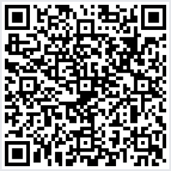

[](https://ko-fi.com/haydgi)

# T20 Hayd — Itens Superiores e Mágicos

Automação completa de **melhorias, encantos e materiais especiais** de itens do **Tormenta20** (Livro Básico, Ameaças de Arton, Heróis de Arton e Deuses de Arton) no FoundryVTT. Substitui a aba de aprimoramentos nativa por uma versão sem limite de slots e com preço automático.

## Requisitos

- FoundryVTT **v13**
- Sistema **Tormenta20** (mínimo **1.5.0**)

## Instalação

Em *Configurar → Módulos Complementares → Instalar Módulo*, cole a URL do manifesto:

```
https://github.com/ahahayd/t20-hayd-itens/releases/latest/download/module.json
```

## Como usar

### Aplicar melhorias e encantos

Abra a ficha de um item físico (arma, armadura, equipamento…) e vá até a aba **Melhorias & Encantos**. Adicione quantos aprimoramentos quiser — não há limite de slots — e o preço do item é recalculado automaticamente a cada mudança.

### Materiais especiais

Os materiais especiais aparecem destacados visualmente na aba, com seus efeitos e ajuste de preço aplicados junto com o restante.

### Injeção Alquímica

A melhoria de Injeção Alquímica é automatizada: o item registra o preparado alquímico e o aplica ao uso, seguindo a regra oficial.

### Homebrews

O Mestre pode criar melhorias e encantos personalizados pelo editor de efeitos incluído, que ficam disponíveis na aba como qualquer aprimoramento oficial.

## Detalhes adicionais

- A aba nativa de aprimoramentos do sistema é substituída apenas visualmente — os dados do item continuam no formato padrão do Tormenta20.

---

## ❤️ Apoio e Comissões

Este módulo é totalmente gratuito. Se você gosta de usá-lo e quiser apoiar seu desenvolvimento, qualquer contribuição é muito bem-vinda!

### ☕ Ko-fi

Você pode apoiar meu trabalho pelo Ko-fi:

[](https://ko-fi.com/haydgi)

Ao apoiar pelo Ko-fi, você também pode deixar uma mensagem com um pedido ou sugestão de automação para Foundry VTT que gostaria de ver. Esses pedidos podem servir de inspiração para futuras funcionalidades, automações ou módulos.

### 🇧🇷 Pix

Se preferir, você também pode apoiar diretamente via Pix.

**Chave Pix aleatória:**

`a8baae96-f4d1-48a5-af25-45bf419fb0fb`

<p align="center">
  
</p>

### 🛠️ Comissões para Foundry VTT

Também aceito comissões para desenvolvimento no Foundry VTT, incluindo a implementação de **módulos completos de aventuras**, respeitando os direitos e licenças dos materiais utilizados, com cenas, atores, itens, diários, automações e outros conteúdos necessários para deixar a aventura pronta para uso no Foundry, além de módulos específicos para Tormenta20 e outros sistemas.

Se tiver interesse em contratar uma comissão, você pode entrar em contato comigo pelo Discord `xddyahaha` para conversarmos sobre o projeto e seu escopo.

<p align="center">
  <sub>Todo apoio é opcional e ajuda a continuar desenvolvendo e mantendo meus módulos para Foundry VTT. ❤️</sub>
</p>

## Aviso

Módulo não oficial, criado por fã, sem afiliação com a Jambô Editora ou com os autores de Tormenta20.
